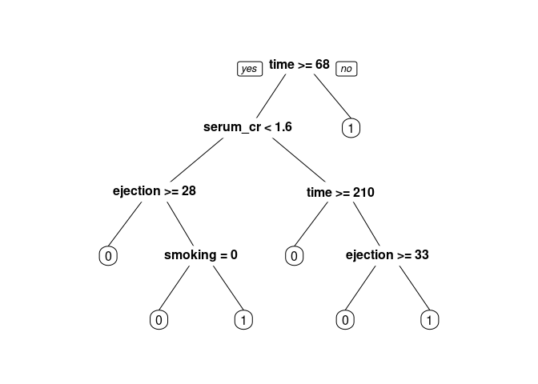
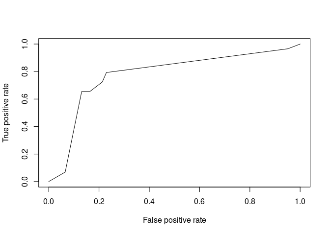

## Read in the data

Source: <https://www.kaggle.com/andrewmvd/heart-failure-clinical-data>

``` r
heart = read.csv("heart_failure_clinical_records_dataset.csv")
heart$DEATH_EVENT = as.factor(heart$DEATH_EVENT)
str(heart)
```

    ## 'data.frame':    299 obs. of  13 variables:
    ##  $ age                     : num  75 55 65 50 65 90 75 60 65 80 ...
    ##  $ anaemia                 : int  0 0 0 1 1 1 1 1 0 1 ...
    ##  $ creatinine_phosphokinase: int  582 7861 146 111 160 47 246 315 157 123 ...
    ##  $ diabetes                : int  0 0 0 0 1 0 0 1 0 0 ...
    ##  $ ejection_fraction       : int  20 38 20 20 20 40 15 60 65 35 ...
    ##  $ high_blood_pressure     : int  1 0 0 0 0 1 0 0 0 1 ...
    ##  $ platelets               : num  265000 263358 162000 210000 327000 ...
    ##  $ serum_creatinine        : num  1.9 1.1 1.3 1.9 2.7 2.1 1.2 1.1 1.5 9.4 ...
    ##  $ serum_sodium            : int  130 136 129 137 116 132 137 131 138 133 ...
    ##  $ sex                     : int  1 1 1 1 0 1 1 1 0 1 ...
    ##  $ smoking                 : int  0 0 1 0 0 1 0 1 0 1 ...
    ##  $ time                    : int  4 6 7 7 8 8 10 10 10 10 ...
    ##  $ DEATH_EVENT             : Factor w/ 2 levels "0","1": 2 2 2 2 2 2 2 2 2 2 ...

## Split the data

``` r
library(caTools)
set.seed(1)
spl = sample.split(heart$DEATH_EVENT, SplitRatio = 0.7)
Train = subset(heart, spl==TRUE)
Test = subset(heart, spl==FALSE)
```

Calculate baseline accuracy based on most frequent value:

``` r
max(table(heart$DEATH_EVENT)) / nrow(heart)
```

    ## [1] 0.6789298

## CART model

``` r
library(rpart)
library(rpart.plot)
HeartTree = rpart(DEATH_EVENT ~ ., data = Train, method="class", minbucket=5)
prp(HeartTree)
```



Generate confusion matrix

``` r
PredictCART = predict(HeartTree, newdata = Test, type = "class")
confusionMatrix = table(Test$DEATH_EVENT, PredictCART)
confusionMatrix
```

    ##    PredictCART
    ##      0  1
    ##   0 51 10
    ##   1 10 19

Calculate accuracy of CART model:

``` r
sum(diag(confusionMatrix)) / nrow(Test)
```

    ## [1] 0.7777778

## ROC curve

``` r
library(ROCR)
PredictROC = predict(HeartTree, newdata = Test)
pred = prediction(PredictROC[,2], Test$DEATH_EVENT)
perf = performance(pred, "tpr", "fpr")
plot(perf)
```



## Random Forests

``` r
library(randomForest)
HeartForest = randomForest(DEATH_EVENT ~ ., data = Train, ntree=200, nodesize=25 )
PredictForest = predict(HeartForest, newdata = Test)
```

Calculate accuracy from confusion matrix:

``` r
forestMatrix = table(Test$DEATH_EVENT, PredictForest)
sum(diag(forestMatrix)) / nrow(Test)
```

    ## [1] 0.7888889

## Cross-validation

``` r
library(caret)
library(e1071)
numFolds = trainControl( method = "cv", number = 10 )
cpGrid = expand.grid( .cp = seq(0.03,0.06,0.005)) 
train(DEATH_EVENT ~ ., data = Train, method = "rpart", trControl = numFolds, tuneGrid = cpGrid )
```

    ## CART 
    ## 
    ## 209 samples
    ##  12 predictor
    ##   2 classes: '0', '1' 
    ## 
    ## No pre-processing
    ## Resampling: Cross-Validated (10 fold) 
    ## Summary of sample sizes: 189, 188, 188, 187, 188, 188, ... 
    ## Resampling results across tuning parameters:
    ## 
    ##   cp     Accuracy   Kappa    
    ##   0.030  0.8572944  0.6694814
    ##   0.035  0.8572944  0.6694814
    ##   0.040  0.8572944  0.6694814
    ##   0.045  0.8572944  0.6694814
    ##   0.050  0.8332035  0.6123667
    ##   0.055  0.8332035  0.6123667
    ##   0.060  0.8284416  0.5903853
    ## 
    ## Accuracy was used to select the optimal model using the largest value.
    ## The final value used for the model was cp = 0.045.

Calculate accuracy of cross-validated CART-model:

``` r
HeartTreeCV = rpart(DEATH_EVENT ~ ., data = Train, method="class", cp = 0.045)
PredictCV = predict(HeartTreeCV, newdata = Test, type = "class")
treeMatrixCV = table(Test$DEATH_EVENT, PredictForest)
sum(diag(treeMatrixCV)) / nrow(Test)
```

    ## [1] 0.7888889
