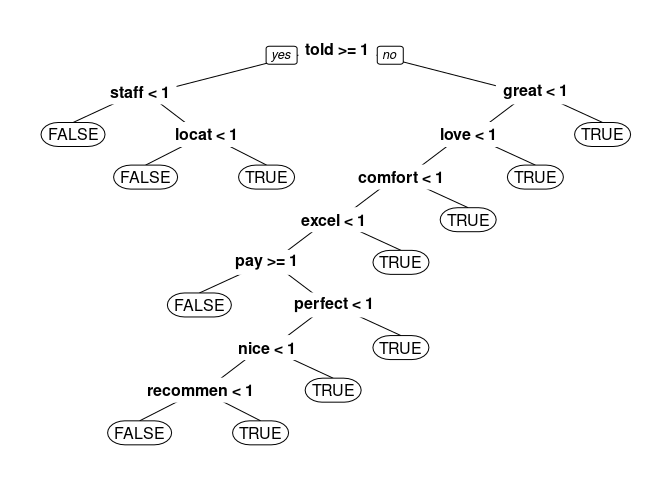

Hotel Review Analysis
================
Viktor Szabo

In this exercise, I use Natural Language Processing (NLP) to predict
whether a hotel rating is positive (greater than 3 stars) based on
Tripadvisor user reviews. Using various statistical methods - like CART
and random forest - I managed to improve the baseline prediction
accuracy (0.69) to 0.83.

## Read in the data

Source: <https://www.kaggle.com/andrewmvd/trip-advisor-hotel-reviews>

``` r
reviews = read.csv("tripadvisor_hotel_reviews.csv", stringsAsFactors=FALSE)
reviews$Positive = as.factor(reviews$Rating > 3)
str(reviews)
```

    ## 'data.frame':    1418 obs. of  3 variables:
    ##  $ Review  : chr  "nice hotel expensive parking got good deal stay hotel anniversary, arrived late evening took advice previous re"| __truncated__ "ok nothing special charge diamond member hilton decided chain shot 20th anniversary seattle, start booked suite"| __truncated__ "nice rooms not 4* experience hotel monaco seattle good hotel n't 4* level.positives large bathroom mediterranea"| __truncated__ "unique, great stay, wonderful time hotel monaco, location excellent short stroll main downtown shopping area, p"| __truncated__ ...
    ##  $ Rating  : int  4 2 3 5 5 5 5 4 5 5 ...
    ##  $ Positive: Factor w/ 2 levels "FALSE","TRUE": 2 1 1 2 2 2 2 2 2 2 ...

``` r
table(reviews$Positive)
```

    ## 
    ## FALSE  TRUE 
    ##   446   972

Calculate baseline accuracy based on most frequent value:

``` r
max(table(reviews$Positive)) / nrow(reviews)
```

    ## [1] 0.6854725

## Create corpus

``` r
library(tm)
```

    ## Loading required package: NLP

``` r
library(SnowballC)
corpus = VCorpus(VectorSource(reviews$Review))
corpus[[1]]$content
```

    ## [1] "nice hotel expensive parking got good deal stay hotel anniversary, arrived late evening took advice previous reviews did valet parking, check quick easy, little disappointed non-existent view room room clean nice size, bed comfortable woke stiff neck high pillows, not soundproof like heard music room night morning loud bangs doors opening closing hear people talking hallway, maybe just noisy neighbors, aveda bath products nice, did not goldfish stay nice touch taken advantage staying longer, location great walking distance shopping, overall nice experience having pay 40 parking night,  "

Transform text:

``` r
# Convert to lower-case
corpus = tm_map(corpus, content_transformer(tolower))
# Remove punctuation
corpus = tm_map(corpus, removePunctuation)
# Remove stopwords and hotel
corpus = tm_map(corpus, removeWords, c("hotel", stopwords("english")))
# Stem document 
corpus = tm_map(corpus, stemDocument)
corpus[[1]]$content
```

    ## [1] "nice expens park got good deal stay anniversari arriv late even took advic previous review valet park check quick easi littl disappoint nonexist view room room clean nice size bed comfort woke stiff neck high pillow soundproof like heard music room night morn loud bang door open close hear peopl talk hallway mayb just noisi neighbor aveda bath product nice goldfish stay nice touch taken advantag stay longer locat great walk distanc shop overal nice experi pay 40 park night"

## Create matrix

``` r
frequencies = DocumentTermMatrix(corpus)
sparse = removeSparseTerms(frequencies, 0.95)
reviewSparse = as.data.frame(as.matrix(sparse))
# Make all variable names R-friendly
colnames(reviewSparse) = make.names(colnames(reviewSparse))
# Add dependent variable
reviewSparse$PositiveRating = reviews$Positive
```

## Split the data

``` r
library(caTools)
set.seed(123)
split = sample.split(reviewSparse$PositiveRating, SplitRatio = 0.7)
trainSparse = subset(reviewSparse, split==TRUE)
testSparse = subset(reviewSparse, split==FALSE)
```

## CART model

``` r
library(rpart)
library(rpart.plot)
reviewCART = rpart(PositiveRating ~ ., data=trainSparse, method="class", minbucket = 15)
prp(reviewCART)
```

<!-- -->

Generate confusion matrix

``` r
predictCART = predict(reviewCART, newdata=testSparse, type="class")
confusionMatrix = table(testSparse$PositiveRating, predictCART)
confusionMatrix
```

    ##        predictCART
    ##         FALSE TRUE
    ##   FALSE    70   64
    ##   TRUE     18  274

Calculate accuracy of CART model:

``` r
sum(diag(confusionMatrix)) / nrow(testSparse)
```

    ## [1] 0.8075117

## Random Forests

``` r
library(randomForest)
set.seed(1)
reviewRF = randomForest(PositiveRating ~ ., data=trainSparse)
predictRF = predict(reviewRF, newdata=testSparse)
```

Calculate accuracy from confusion matrix:

``` r
confusionMatrixRF = table(testSparse$PositiveRating, predictRF)
confusionMatrixRF
```

    ##        predictRF
    ##         FALSE TRUE
    ##   FALSE    71   63
    ##   TRUE      8  284

``` r
sum(diag(confusionMatrixRF)) / nrow(testSparse)
```

    ## [1] 0.8333333
